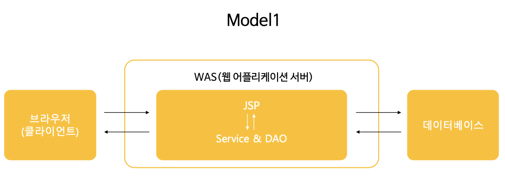
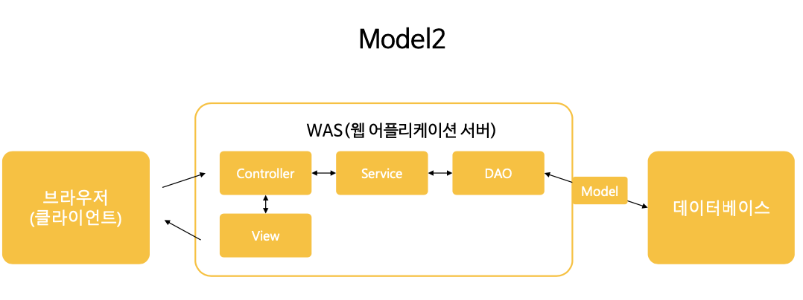
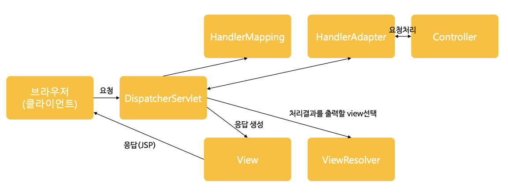

# 생명주기(Life Cycle)

## 11-1. 스프링 컨테이너 생명주기

> GenericXmlApplicationContext 를 이용한 스프링 컨테이너 초기화(생성)
~~~
GenericXmlApplicationContext ctx = new GenericXmlApplicationContext("classpath:appCtx.xml");
~~~
✅ 스프링 컨테이너의 생성과 빈 객체의 생성시점은 동일하다.(유기적)

> getBean()을 이용한 빈(Bean) 객체 이용

~~~
BookRegisterService bookRegisterService = ctx.getBean("bookRegisterService", BookRegisterService.class);
~~~

> close()를 이용한 스프링 컨테이너 종료
~~~
ctx.close();
~~~
✅ 스프링 컨테이너에서 생성된 빈 객체도 소멸된다.(메모리에서 사라진다.)

## 11-2. 빈(Bean) 객체 생명주기

빈(Bean) 객체의 생명주기는 스프링 컨테이너의 생명주기와 같이 한다.

- 생성시점에 호출되는 메소드 : afterPropertiesSet()
- 소멸시점에 호출되는 메소드 : destroy()

## 11-3. init-mathod, destroy-method 속성

<< 빈 객체의 생성과 소멸을 이용해서 특정한 작업을 하는 방법 >>

특정한 작업 -> 예를들어, 아이디와 비밀번호 로그인 db인증절차, 특정네트워크 상에 있는 자원을 끌어온다던지

1. 인터페이스를 이용하는 방법

> BookSearchService.java
~~~
public class BookSearchService implements InitializingBean, DisposableBean{

    ...

	@Override
	public void destroy() throws Exception{
		System.out.println("object dispose");
	}
	@Override
	public void afterPropertiesSet() throws Exception{
		System.out.println("obejct create");
	}
}
~~~

> appCtx.xml
~~~
<bean id="bookRegisterService" class="com.brms.book.service.BookRegisterService"></bean>
~~~

2. init-mathod, destroy-method 을 이용하는 방법

> MemberRegisterService.java
~~~
public void initMethod() {
    System.out.println("MemberRegister 빈(Bean)객체 생성 단계");
}

public void destroyMethod() {
    System.out.println("MemberRegister 빈(Bean)객체 소멸 단계");
}
~~~

> appCtx.xml
~~~
<bean id="memberRegisterService" class="com.brms.member.service.MemberRegisterService"
	init-method="initMethod" destroy-method="destroyMethod"></bean>
~~~

# 어노테이션을 이용한 스프링 설정 - 1

👉🏻 스프링 설정파일 제작을 Java파일로 제작할 수 있는 방법에 대해서 학습한다.

## 12-1-1. XML파일을 Java파일로 변경하기

~~~
<bean id="memberRegisterService" class="com.brms.member.service.MemberRegisterService"/>
~~~

⬇️

~~~
@Bean
public MemberRegisterService memberRegisterService(){
	return new MemberRegisterService(memberDao());
}
~~~

# 어노테이션을 이용한 스프링 설정 - 2
 
👉🏻 xml을 이용한 스프링 설정파일 제작을 Java파일로 제작할 수 있는 방법에 대해서 학습한다.

## 12-2-1. Java 파일 분리

✅ 기능별로 구분하여 분리하는 것이 일반적이다.
(dao, 서비스,DB 관련된 기능, 유틸 들)

[TIP] ctrl + shift + o => 참조되지 않는 패키지는 삭제된다.

> 분리한 스프링 설정파일을 모두 넣어서 객체 생성
~~~
AnnotationConfigApplicationContext ctx = 
new AnnotationConfigApplicationContext(
MemberConfig1.class, MemberConfig2.class, MemberConfig3.class);
~~~

## 12-2-2. @Import 어노테이션

👉🏻 하나의 파일에 import한다.

> MemberConfig1.java 
~~~
@Configuration
@Import({ MemberConfig2.class, MemberConfig3.classs})
public class MemberConfig1{
	...
}
~~~

# 웹 프로그래밍 설계 모델

## 13-1 웹 프로그래밍을 구축하기 위한 설계 모델

`Model1` - html 파일 안에 java, 각종 태그들을 작성. 

장점) 개발 속도가 빠르다.

단점) 유지보수가 어렵다.

`Model2` - 철저하게 기능은 Service 넣고, 데이터연동은 Dao, 사용자에게 보여주는 것은 View, 컨트롤해주는 것은 Controller에 각각 기능별로 빼주는 것.(MVC) 
Spring은 Model2

장점) 유지보수가 쉽다.

## 13-2 스프링 MVC프레임워크 설계 구조

1. 클라이언트 요청이 들어오면 DispatcherServlet이 받아서 HandlerMapping 에게 주는데, HandlerMapping 은 가장 적합한 Controller를 찾아준다.
2. HandlerAdapter는 해당하는 Controller 에 가장 적합한 메소드를 찾아준다.
3. 데이터라 가공되어서 결과가 나오면 DispatcherServlet은 ViewResolver 에게 보내서 가장 적합한 JSP페이지(뷰)를 선택해준다.
4. 응답을 생성하고 이 응답을 클라이언트에게 응답처리를 한다.

👉🏻 Controller(백엔드), View(프론트엔드) 만 개발자가 구현한다.

## 13-3 DispatcherServlet 설정

✅ web.xml에 서블릿을 매핑

WEB-INF폴더의 web.xml파일 만들고, <servlet>태그와 <servlet-mapping>태그를 이용한다.
~~~
<servlet>
	<servlet-name>서블릿 별칭</servlet-name>
	<servlet-class>서블릿명(패키지 이름을 포함한 전체서블릿명)</servlet-class>
</servlet> 
<servlet-mapping>
	<servlet-name>서블릿별칭</servlet-name>
	<url-pattern>/맵핑명</url-pattern> 
</servlet-mapping>
~~~

1. 초기파라미터에서 지정한 파일(servlet-context.xml)를 이용해서 스프링 컨테이너를 생성

2. 초기화 파라미터에서 스프링 설정파일을 지정하지 않은 경우
서블릿별칭을 이용해서 스프링 컨테이너를 생성

## 13-4 Controller 객체 - @Controller

> 스프링 설정파일에 annotation-driven 태그 설정하여 빈 객체를 생성
~~~
<annotation-driven />
~~~

> Controller 객체로 사용할 클래스 정의
~~~
@Controller
pubic class HomeController {
	...
}
~~~

## 13-5 Controller 객체 - @RequestMapping

> Controller 안의 메소드는 RequestMapping 를 이용해 메소드를 실행
~~~
@RequestMapping("/success")
public String success(Model model){
	return "success";
}
~~~

## 13-6 Controller 객체 - Model 타입의 파라미터
~~~
@RequestMapping("/success")
public String success(Model model) {
⬇️
model.setAttribute("tempData", "model has data");
~~~

- 개발자는 Model 객체에 데이터를 담아서 DispatcherServlet 에 전달할 수 있다.

- DispatcherServlet 에 전달된 Model 데이터는 View에서 가공되어 클라이언트한테 응답처리된다.

## 13-7 View 객체

ViewResolver 가 적합한 뷰를 찾아준다.

JSP 파일명 : /WEB-INF/views/success.jsp

## 13-8 전체적인 웹프로그래밍 구조

1. 최초 사용자 요청 (http://localhost:8080/ch08/success)
2. DispatchSerlet이 요청을 받아서 web.xml에서 서블릿 등록을 하고 스프링 초기 파일을 설정한다.
3. Controller(@Controller 어노테이션이 적용된 클래스 검색)이 적합한 컨트롤러를 찾아준다. 
4. 사용자 요청에 해당하는 메서드 실행(@RequestMapping("success") 어노테이션이 적용된 메서드 검색 및 실앻)
5. Model, View전달
6. View 검색(ViewResolver 에 의해서 검색된 success.jsp 검색 및 실행)
7. View(브라우저에 JSP를 이용한 응답)

# 스프링 MVC 웹서비스 - 1

## 14-1. 웹 서버(Tomcat) 다운로드

8.5 버전을 다운로드했다.

<https://tomcat.apache.org/download-80.cgi>

## 14-2. 웹 서버(Tomcat) 와 이클립스 연동

<http://localhost:8090/>

## 14-3. 이클립스에 STS(Spring Toll Suit) 설치

help > eclipse marketplace > sps 검색 > Spring tools 3 Add-on 다운로드

## 14-4. STS를 이용한 웹 프로젝트 생성

## 14-5. 스프링 MVC 프레임워크를 이용한 웹프로젝트 분석

# 스프링 MVC 웹서비스 - 2

## 15-1. 프로젝트 전체 구조

1. java파일 : java파일들이 위치한다. 주로 패키지로 묶어서 관리한다. 웹 애플리 케이션에서 사용되는 Controller, Service, DAO객체들이 위치한다.
2. webapp : 웹과 관련된 파일들(스프링 설정파일, JSP파일, HTML파일 등..)이 위치한다.
3. resources : JSP파일을 제외한 html, css, js파일등이 위치한다.
4. spring폴더 : 스프링 컨테이너를 생성하기 위한 스프링 설정파일이 위치한다.
5. views 폴더 : View로 사용될 JSP파일이 위치한다.
6. pom.xml파일 : 메인 레파지토리에서 프로젝트에 필요한 라이브러리를 내려받기 위한 메이븐 설정 파일

## 15-2. web.xml

 웹 어플리케이션에서 최초 사용자의 요청이 발생하면 가장먼저 DispatcherServlet이 사용자의 요청을 받는다고 하였다. 
 
 따라서 개발자는 `DispatcherServlet을 서블릿으로 등록 해주는 과정`을 설정해 주어야 한다. 
 
 그리고 사용자의 모든 요청을 받기 위해서 서블릿 맵핑 경로는 ‘/’로 설정한다.

## 15-3. DispatcherServlet

사용자의 모든 요청을 DispatcherServlet이 받은 후 HandlerMapping 객체에 Controller 객체 검색을 요청한다.

 그러면 `HandlerMapping 객체는 프로젝트 에 존재하는 모든 Controller 객체를 검색`한다. 
 
 HandlerMapping 객체가 Controller 객체를 검색해서 DispatcherServlet 객체에 알려주면 DispatcherServlet 객체는 다시 HandlerAdapter 객체에 사용자의 요청에 부합하는 메소드 검색을 요청한다. 
 
 그러면 `HandlerAdapter 객체는 사용자의 요청 에 부합하는 메소드를 찾아서 해당 Controller 객체의 메소드를 실행`한다. 
 
 Controller 객체의 메소드가 실행된 후 Controller 객체는 HandlerAdapter 객체에 ModelAndView 객체를 반환하는데 `ModelAndView 객체에는 사용자 응답에 필요한 데이터정보와 뷰정보(JSP파일)가 담겨있다.` 
 
 다음으로 HandlerAdapter 객체는 ModelAndView 객체를 다시 DispatcherServlet 객체에 반환한다.

## 15-4. servlet-context.xml

앞에서 DispatcherServlet를 서블릿으로 등록하는 과정을 살펴봤다. 서블릿으로 등록 될 때 contextConfigLocation 이름으로 초기화 파라미 터를 servlet-context.xml 로 지정하고 있는데 이때 지정된 servlet-context.xml 파일이 `스프링 설정의 역할을 하는 파일`이다.

스프링 설정 파일은 클래스로부터 객체(빈:bean)를 생성하고 조립하는 역할을 한다고 학습했다. servlet-context.xml에서도 마찬가지로 프로젝트에 필요한 `객체(빈:bean) 를 생성하고 조립`한다.

## 15-5. Controller(컨트롤러)

✅ 사용자의 요청을 실제로 처리하는 객체들
- Controller 
- Service
- DAO
~~~
@Controller
public class HomeController {
@RequestMapping(value = "/", method = RequestMethod.GET)
	public String home(Locale locale, Model model) { 
		...
		return "home";
	} 
}
~~~

뷰의 이름을 return값으로 설정.

## 15-6. View(뷰)

클라이언트 요청 정보(URL맵핑값)에 해당하는 JSP파일 실행

# STS를 이용하지 않은 웹 프로젝트

## 16-1. 스프링 MVC 웹 어플리케이션 제작을 위한 폴더 생성
C:\spring\pjt\lec16Pjt001\src C:\spring\pjt\lec16Pjt001\src\main C:\spring\pjt\lec16Pjt001\src\main\java C:\spring\pjt\lec16Pjt001\src\main\webapp C:\spring\pjt\lec16Pjt001\src\main\webapp\resources C:\spring\pjt\lec16Pjt001\src\main\webapp\WEB-INF C:\spring\pjt\lec16Pjt001\src\main\webapp\WEB-INF\spring C:\spring\pjt\lec16Pjt001\src\main\webapp\WEB-INF\views

## 16-2. pom.xml 및 이클립스 import

## 16-3. web.xml 작성

## 16-4. 스프링 설정 파일(servlet-context.xml)작성

## 16-5. root-context.xml 작성

## 15-5. 컨트롤러와 뷰 작성

## 16-7. 실행

# Service & Dao 객체 구현

## 17-1. 웹 어플리케이션 준비

## 17-2. 한글 처리

## 17-3. 서비스 객체 구현

✅ 방법1 : new 연산자를 이용한 service 객체 생성 및 참조 

~~~
MemberService service = new MemberService();
~~~

✅ 방법2 : 스프링 설정파일을 이용한 서비스 객체 생성 및 의존 객체 자동 주입

~~~
<beans:bean id="service" class="com.bs.lec17.member.service.MemberService"></beans:bean>
@Autowired MemberService service;
~~~

✅ 방법3 : 어노테이션을 이용해서 서비스 객체 생성 및 의존 객체 자동 주입
~~~
@Repository("memService")
public class MemberService implements IMemberService {
@Resource(name="memService") MemberService service;
~~~

## 17-4. DAO 객체 구현

✅ 방법 : 어노테이션을 이용해서 DAO 객체 생성 및 의존 객체 자동 주입

~~~
@Repository
public class MemberDao implements IMemberDao {
@Autowired MemberDao dao;
~~~

# Controller 객체 구현 - 1

## 18-1. 웹 어플리케이션 구현

## 18-2. @RequestMapping 을 이용한 URL 맵핑

- 메소드에 @RequestMapping 적용

	http://localhost:8090/lec18/memJoin ➡️ memJoin() 실행

	👉🏻 get방식은 디폴트여서 명시해주지 않아도 된다. 

- 클래스에 @RequestMapping적용

	👉🏻공통된 속성이 존재할 때(실무에서 많이 쓰인다)

- 데이터 전송방식에 따른 method 속성 설정
 

## 18-3. 요청 파라미터

- HttpServletRequest 객체를 이용한 HTTP 전송 정보 얻기

- @RequestParam 어노테이션을 이용한 HTTP 전송 정보 얻기

- 커맨드 객체를 이용한 HTTP전송 정보 얻기

	👉🏻반드시 setter, getter를 이용해서 가져온다.

	✅ 최근에 가장 대중적으로 사용한다.(코드의 중복을 줄이고 사용이 간단).

# Contoller 객체 구현 - 2

## 19-1. @ModelAttribute

커맨드 객체의 이름을 변경할 수 있고, 이렇게 변경된 이름은 뷰에서 커맨드 객체를 참조할 때 사용된다.

특정한 경우 예를 들어 중복가능성이 있거나, 이름이 너무 길거나 등의 이유로 다른 이름으로 사용하고 싶은 경우에 사용한다. 

EX) member 말고 mem 으로 사용하고 싶다.

> 컨트롤러
~~~
public String memRemove(@ModelAttribute("mem")) Member member);
~~~

> 뷰
~~~
${mem.memId}
~~~

## 19-2. 커맨드 객체 프로퍼티 데이터 타입

데이터가 기초데이터 타입의 경우

중첩 커맨드 객체를 이용한 List 구조인 경우 

⭐️ 직접 구현하면서 익힐 것

## 19-3. Model & ModelAndView

컨트롤러에서 뷰에 데이터를 전달하기 위해 사용되는 객체로 Model과 ModelAndView가 있다.두 객체의 차이점은 Model은 뷰에 데이터만을 전달하기 위한 객체이고, ModelAndView는 데이터와 뷰의 이름을 함께 전달하는 객체이다.